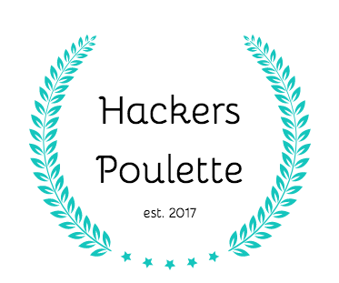
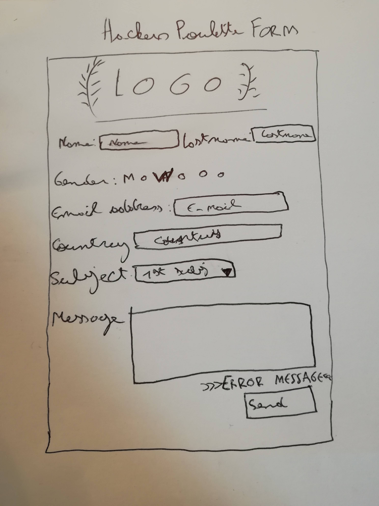

# hackers-poulette

Creation of a form using PHP

## Created by :

[Grégoire Wastelain](https://github.com/gwastelain) 

## About

This site is an exercise for the Johnson 4.14 promotion of BeCode Brussels.

### Missions objectives :

_"The company Hackers Poulette ™ sells Raspberry Pi accessory kits to build yourself. They want to allow their users to contact their support team. Your mission is to develop a PHP script displaying a contact form and processing the received answer (sanitize, validate, answer the user)."_
[Instructions](https://github.com/becodeorg/BXL-Johnson-4.14/tree/master/06-PHP/hackers_poulette) 

## Form
You will find the form [here](https://hackers-poulette-gw.herokuapp.com/).

## Mockup

## Tech

- HTML
- CSS
- PHP
- Javascript
